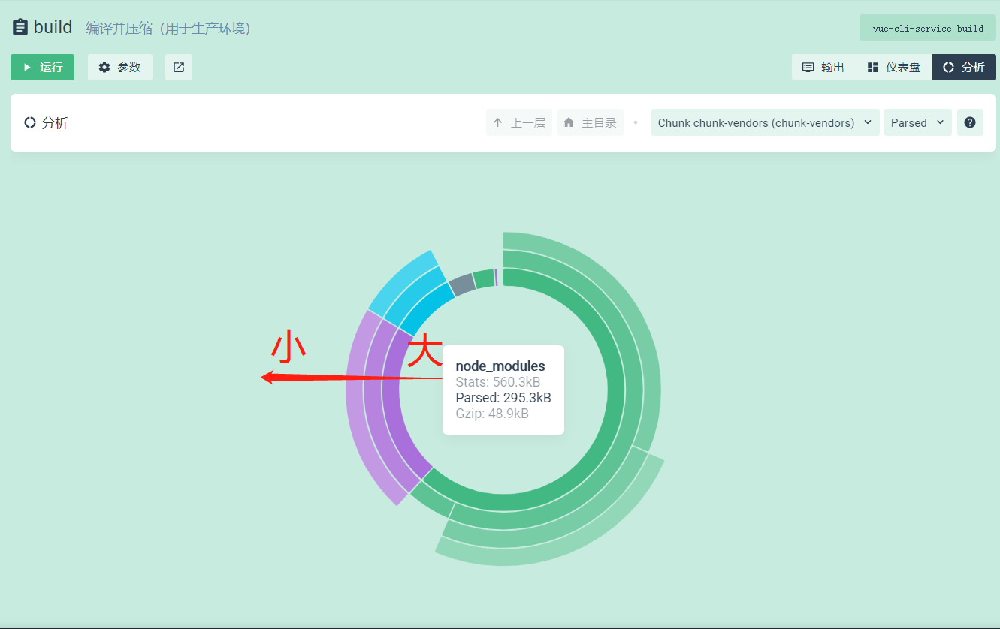
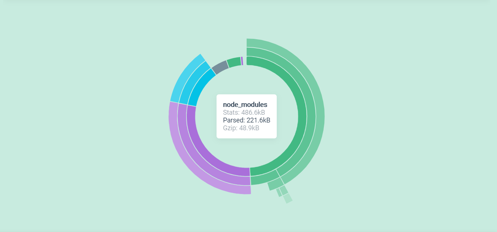
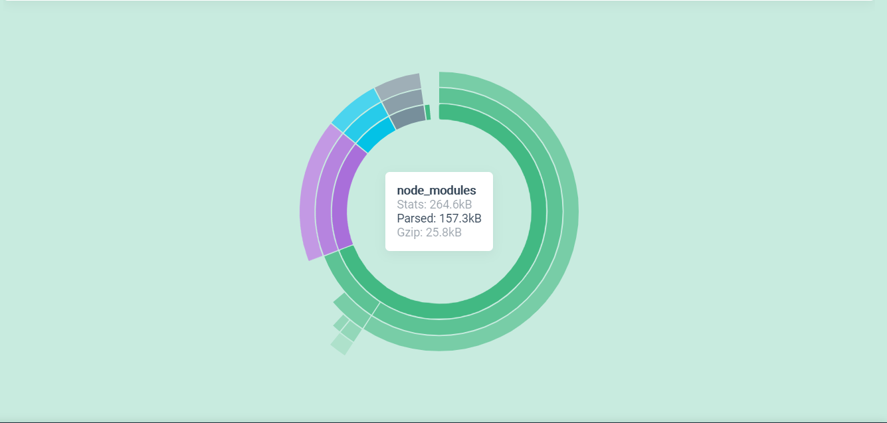

# 优化建议


## 1. 使用HTML5 cache manifate 文件 (h5.1已经弃用)


## 2. 打包优化

### 使用cli图形界面
使用以下命令，进入图形界面，然后打包 。
```
vue ui
```


分析下图，我们可以得到 : 圆环的内环到外环，体积是从大 -> 小的

这意味着我们可以将某些包提出来，不将它打进包中，例如将`vue、vue-router`这些包提出来，放到cdn 



另外，vant的部分样式是自动从cdn加载的，所以我们可以将
`import "vant/lib/icon/local.css";` 从首页注释掉



分析部分减少了`70k`，但是gzip并没有减少...


### 使用CDN
我们对vue这个包设置`cdn`

我们在`public/index.html`中加入以下代码
```html
  <% if(process.env.NODE_ENV === "production") %>
```

在vue.config.js中加入

```js
module.exports = {
  configureWebpack: config => {
    if (process.env.NODE_ENV === "production") {
      // 为生产环境修改配置...
      config.externals = {
        // import value from key
        vue: "Vue"
      };
    } else {
      // 为开发环境修改配置...
      config.devtool = "source-map";
    }
  },
  ...
};

```

这样，在生产环境中，`cli`的`webpack`就不会将`vue`打包进去，而是使用`360CDN`

我们再将它打包一下，发现又减少了`70k`



同理 : 将全家桶的其余部分配置CDN，刚好凑成3个CDN连接，为什么最好是3个呢，因为在浏览器中，html文档内的资源是并行加载的，而且一个域名往往只能同时加载3个

最终，`vendors`公共部分可以得到`120.9kb`。gzip后只有`13.5kb`