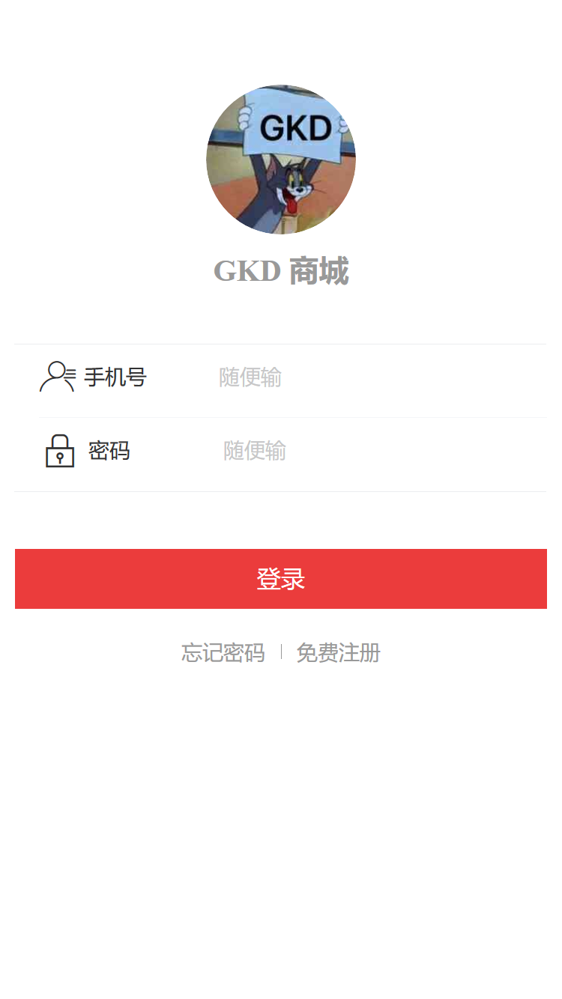

# 搞快点商城(移动端)

使用vant(有赞)UI组件库的SPA单页面商城应用

# 项目截图

# 功能列表
- 首页
- 购物车
- 订单
- 个人中心
- 登录页面
- 商品详情
- 完整的下单支付流程
- 待补充 : 完整的收获地址选择流程

# 项目结构

# 相关库与插件

- Vue + Vuex + Vue-Router + Sass
- yy-axios (本人使用typescript重构的axios)
- vant
- typescript
- postcss-to-viewport (使用vw 作为适配单位)